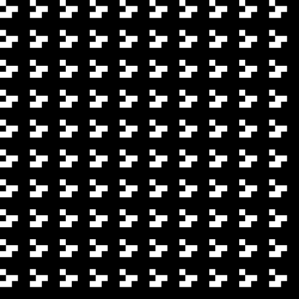
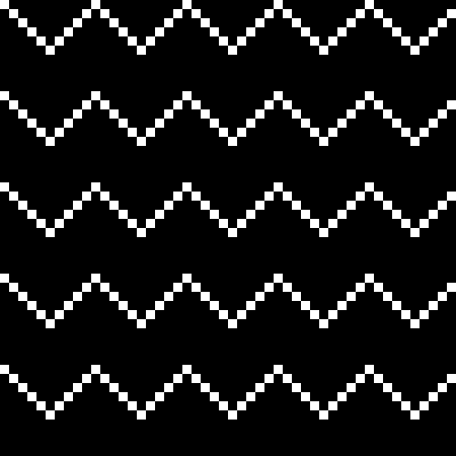
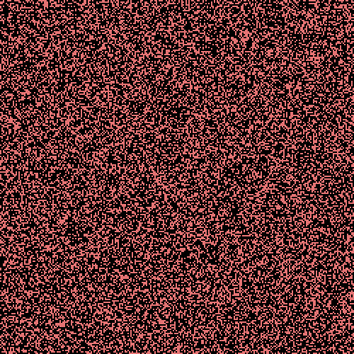

# Go's Game of Liberty

[](https://pkg.go.dev/github.com/DumDumGeniuss/ggol)
[](https://goreportcard.com/report/github.com/DumDumGeniuss/ggol)
[](https://github.com/DumDumGeniuss/ggol/actions/workflows/go.yml)

Go's Game of Liberty is a go package that provides a set of API for you to build a game in 2d map, this API was initially for helping you build the [Conway's Game of Life](https://en.wikipedia.org/wiki/Conway%27s_Game_of_Life), but later we found more possibilities of it, so the Go's Game of Liberty came out.

Looking forward to seeing your masterpiece built with the API :).

For more details, please check [API document](https://pkg.go.dev/github.com/DumDumGeniuss/ggol) here.

## Features

* Easy to setup.
* Concurrently safe.
* Fully customizable.

## Install

```bash
go get github.com/DumDumGeniuss/ggol
```

## Usage

### Build Conway's Game of Life

The example below shows you how to buil a the Conway's Game of Life with the API.

```go
package main

import (
    "fmt"

    "github.com/DumDumGeniuss/ggol"
)

// Define your unit type, in Conway's
// Game of Life, the smallest unit refers to a cell,
// and the only information we need to know is "Alive".
type CgolCell struct {
    Alive bool
}

// This is the core part of the game, it tells the game
// how to generate the next status of the given unit.
// This generator here implements 4 basic rules of Conways Game
// of Life, if you want, you can add your custom rules here :).
func cgolNextUnitGenerator(
    // Coordinate of the given unit.
    coord *ggol.Coordinate,
    // Pointer to the current unit status.
    unit *CgolCell,
    // A getter for getting adjacent units, check this type ggol.AdjacentUnitGetter[T] for details.
    getAdjacentUnit ggol.AdjacentUnitGetter[CgolCell],
) (nextCgolCell *CgolCell) {
    nextUnit := *unit

    // Get live adjacent cells count
    // We need to to implement 4 basic rules of
    // Conways Game of Life.
    var liveAdjacentCellsCount int = 0
    for i := -1; i < 2; i += 1 {
        for j := -1; j < 2; j += 1 {
            if !(i == 0 && j == 0) {
                // Pay attention to "isCrossBorder", if the adjacent unit in the relative coordinate
                // is on other side of the map, "isCrossBorder" will be true.
                // So if you want to allow your cells to be able to go beyond border, ignore "isCrossBorder" here.
                adjUnit, isCrossBorder := getAdjacentUnit(coord, &ggol.Coordinate{X: i, Y: j})
                if adjUnit.Alive && !isCrossBorder {
                    liveAdjacentCellsCount += 1
                }
            }
        }
    }
    if nextUnit.Alive {
        if liveAdjacentCellsCount == 2 || liveAdjacentCellsCount == 3 {
            // Cell survives due to rule 2.
            nextUnit.Alive = true
            return &nextUnit
        } else {
            // Cell dies of rule 1 or rule 3.
            nextUnit.Alive = false
            return &nextUnit
        }
    } else {
        // Cell becomes alive due to rule 4.
        if liveAdjacentCellsCount == 3 {
            nextUnit.Alive = true
            return &nextUnit
        }
        return &nextUnit
    }
}

// You have to generate your initial cells.
func generateInitialCgolCells(width int, height int, cell CgolCell) *[][]CgolCell {
	cells := make([][]CgolCell, width)
	for x := 0; x < width; x += 1 {
		cells[x] = make([]CgolCell, height)
		for y := 0; y < height; y += 1 {
			cells[x][y] = cell
		}
	}

	return &cells
}

func main() {
    // Initial status of all units.
    initialCgolCell := CgolCell{Alive: false}
    initialCgolCells := generateInitialCgolCells(3, 3, initialCgolCell)

    // Alrighty, let's create a new game with the given cells
    game, _ := ggol.NewGame(initialCgolCells)
    size := game.GetSize()
    // Set generator of next unit.
    game.SetNextUnitGenerator(cgolNextUnitGenerator)

    // Let's bring 3 cells alive to form a Blinker pattern :).
    // What is Blinker? https://conwaylife.com/wiki/Blinker
    game.SetUnit(&ggol.Coordinate{X: 1, Y: 0}, &CgolCell{Alive: true})
    game.SetUnit(&ggol.Coordinate{X: 1, Y: 1}, &CgolCell{Alive: true})
    game.SetUnit(&ggol.Coordinate{X: 1, Y: 2}, &CgolCell{Alive: true})

    // This will generate next units, the looking of next generation of units is depending on "cgolNextUnitGenerator"
    // you just passed in "SetNextUnitGenerator" above.
    game.GenerateNextUnits()

    // Let's see if we generate the next status of the Blinker correctly.
    // If it's correct, all units below should have "Alive" attribute as true.
    for x := 0; x < size.Width; x += 1 {
        unit, _ := game.GetUnit(&ggol.Coordinate{X: x, Y: 1})
        fmt.Printf("%v ", unit.Alive)
    }
    // true true true
}
```

### Conway's Game of Life

[Sample Code](./example/conways_game_of_life.go)



### Game of Wave

Build multiple wave that keep going up forever.

[Sample Code](./example/game_of_wave.go)



### Game of Black and White

You can switch black and white in every iteration.

[Sample Code](./example/game_of_black_and_white.go)


### Game of King

When cells collide, they get more power, cells with greatest power will show in gold color.

[Sample Code](./example/game_of_king.go)



### Game of Matrix

The rain of code in the movie Matrix.

[Sample Code](./example/game_of_matrix.go)


## Development

We use Makefile to setup develop environments.

### Run Unit Tests

```bash
make test
```

### Setup Pre-commit Hook

```bash
make setup-pre-commit
```

### Build Sample GIFs As Demo

You can refer to sample code in [here](./example/) to build GIFs of your custom games.

```bash
make demo
```

## License

[MIT License](./LICENSE)
