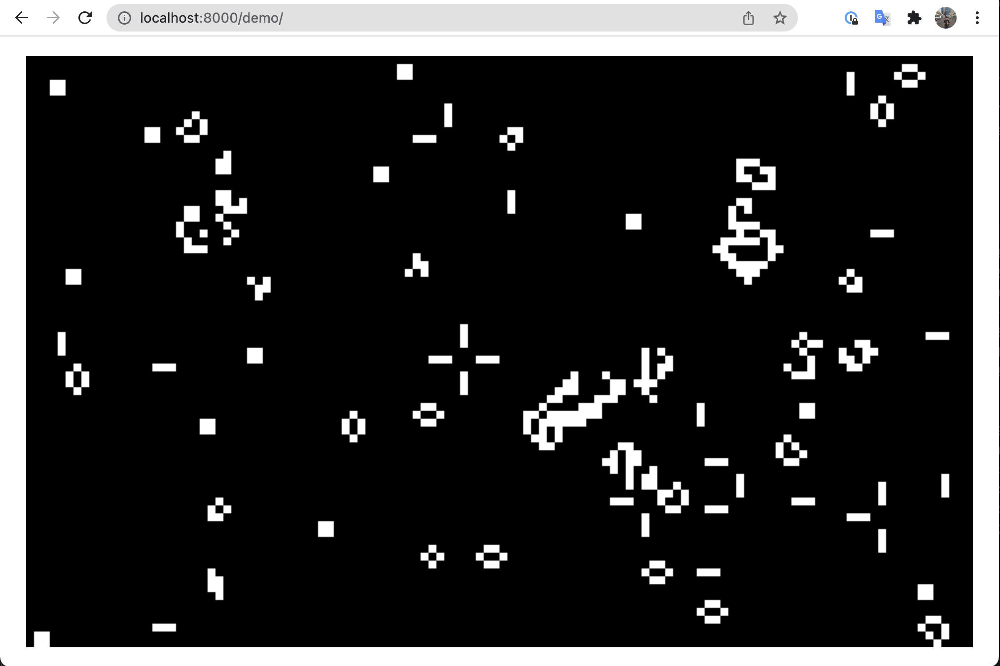

# Goways Game of Life

Goways Game of Life is a go package that provides fundamental functions of a Conway's Game of Life, and it's **cocurrently safe**.

The goal is to help you build a Conway's Game of Life in the way you like.

## Installed This Package

```bash
go get github.com/DumDumGeniuss/goways-game-of-life/game
```

## Initialize A New Game

```go
package main

import {
    "fmt"
    
    "github.com/DumDumGeniuss/goways-game-of-life/game"
)

main() {
    seed := [][]bool{
        {false, true, false},
        {false, true, false},
        {false, true, false},
    }
    // Start a new game with given seed.
    game, _ := game.NewGame(3, 3, &seed)
    // Generate next generation.
    game.Evolve()
    // Get current generation.
    fmt.Println(game.GetGeneration())
    // {
    //   {false, false, false}
    //   {true, true, true}
    //   {false, false, false}
    // }
}
```

## Demo

You can see a quick demo by cloning this repo to your local machine.

```bash
git clone https://github.com/DumDumGeniuss/goways-game-of-life.git
cd goways-game-of-life
go mod tidy
go run main.go
# [GIN-debug] Listening and serving HTTP on :8000
```

And you can open your browser and view the demo on [http://localhost:8000/demo](http://localhost:8000/demo)


