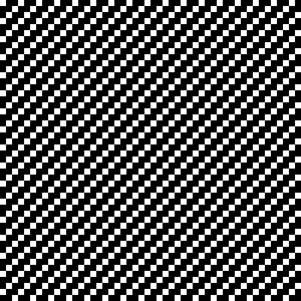
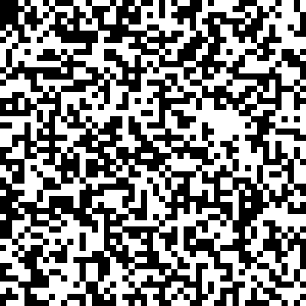

# Gonways Game of Life

[](https://pkg.go.dev/github.com/DumDumGeniuss/ggol)
[](https://goreportcard.com/report/github.com/DumDumGeniuss/ggol)
[](https://app.travis-ci.com/DumDumGeniuss/ggol)

Gonways Game of Life is a go package that provides fundamental functions for running [Conway's Game of Life](https://en.wikipedia.org/wiki/Conway%27s_Game_of_Life),

The goal is to help you build a Conway's Game of Life in the way you like.

## Installed This Package

```bash
go get github.com/DumDumGeniuss/ggol
```

## Initialize A New Game

```go
package main

import {
    "fmt"
    
    "github.com/DumDumGeniuss/ggol"
)

// Define the type of your CustomCell, it could be anything you like.
// But to implement Conway's Game of Life, "Alive" or something alike field is necessary here.
type CustomCell struct {
    Alive bool
}

// Your custom cell iterator, the example below implements the standard rules of Conway's Game of Life.
// You can add various kinds of fields to your CustomCell and make the game different!
// *CAUTIOUS*, please do not change anything of adjacentCells, that will change the expected outcome.
var customIterateCellFunc ggol.IterateCellFunc[CustomCell] = func(
    coord *ggol.Coordinate,
    cell CustomCell,
    getAdjacentCell ggol.GetAdjacentCellFunc[CustomCell],
) *CustomCell {
    newCell := cell

    var aliveAdjacentCellsCount int = 0
    for i := -1; i < 2; i += 1 {
        for j := -1; j < 2; j += 1 {
            if !(i == 0 && j == 0) {
                adjCell, isCrossBorder := getAdjacentCell(coord, &Coordinate{X: i, Y: j})
                if adjCell.Alive && !isCrossBorder {
                    aliveAdjacentCellsCount += 1
                }
            }
        }
    }
    if newCell.Alive {
        if aliveAdjacentCellsCount != 2 && aliveAdjacentCellsCount != 3 {
            newCell.Alive = false
            return &newCell
        } else {
            newCell.Alive = true
            return &newCell
        }
    } else {
        if aliveAdjacentCellsCount == 3 {
            newCell.Alive = true
            return &newCell
        } else {
            newCell.Alive = false
            return &newCell
        }
    }
}

main() {
    game, _ := ggol.NewGame(
        &ggol.Size{Height: 3, Width: 3}, // Size of the game.
        CustomCell{Alive: false}, // Initial Custom Cell.
        customIterateCellFunc, // Your custom rools of the game, see above.
    )

    // Bring cells at (1, 0), (1, 1), (1, 2) to alive.
    game.SetCell(&ggol.Coordinate{X: 1, Y: 0}, CustomCell{Alive: true})
    game.SetCell(&ggol.Coordinate{X: 1, Y: 1}, CustomCell{Alive: true})
    game.SetCell(&ggol.Coordinate{X: 1, Y: 2}, CustomCell{Alive: true})

    // Generate next Generation.
    game.Iterate()

    // We created a Blinker pattern above, let's see if cell at (0, 1)
    // became alive in next generation :).
    fmt.Println(game.GetCell(&ggol.Coordinate{X: 0, Y: 1}))
    // {true}
}
```

## What You Can Build?

You can build this


And this



And for sure, classic game



## Build GIF

```bash
git clone https://github.com/DumDumGeniuss/ggol.git
cd ggol
go mod tidy
go run ./cmd/*
```

## Document

### NewGame

### Reset

### Iterate

### SetCell

### GetSize

### GetCell

### GetGeneration
