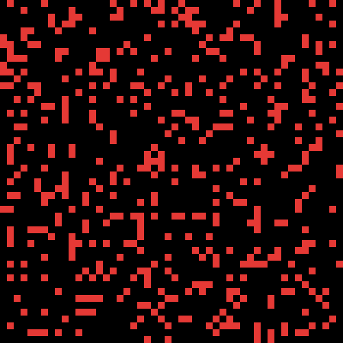

# Gonways Game of Life

[](https://pkg.go.dev/github.com/DumDumGeniuss/ggol)
[](https://goreportcard.com/report/github.com/DumDumGeniuss/ggol)
[](https://app.travis-ci.com/DumDumGeniuss/ggol)

Gonways Game of Life is a go package that provides fundamental functions for running [Conway's Game of Life](https://en.wikipedia.org/wiki/Conway%27s_Game_of_Life),

The goal is to help you build a Conway's Game of Life in the way you like.

## Features

* Easy to setup.
* Concurrently safe.
* Fully customizable.

## Install

```bash
go get github.com/DumDumGeniuss/ggol
```

## Usage

### Standard Game

The example below shows you how to buil a standard Conway's Game of Life with the API.

```go
package main

import {
    "fmt"
    
    "github.com/DumDumGeniuss/ggol"
)

// Define your area type, in standard Conway's
// Game of Life, an area can have a live cell at most,
// so we need the field "HasLiveCell" here.
type MyArea struct {
    HasLiveCell bool
}

// This is the core part of the game, it tells the game
// how to iterate to get next stage of the area.
// This iterator implement 4 basic rules of Conways Game
// of Life, you can custom your rules here :).
func areaIterator (
    coord *ggol.Coordinate,
    area *MyArea,
    getAdjacentArea ggol.GetAdjacentArea[MyArea],
) *MyArea {
    newArea := *area

    // Get live adjacent cells count
    // We need to to implement 4 basic rules of
    // Conways Game of Life.
    var liveAdjacentCellsCount int = 0
    for i := -1; i < 2; i += 1 {
        for j := -1; j < 2; j += 1 {
            if !(i == 0 && j == 0) {
                adjArea, isCrossBorder := getAdjacentArea(coord, &Coordinate{X: i, Y: j})
                if adjArea.HasLiveCell && !isCrossBorder {
                    liveAdjacentCellsCount += 1
                }
            }
        }
    }
    if newArea.HasLiveCell {
        // Can this live cell survive?
        if liveAdjacentCellsCount == 2 || liveAdjacentCellsCount == 3 {
            newArea.HasLiveCell = true
            return &newArea
        } else {
            newArea.HasLiveCell = false
            return &newArea
        }
    } else {
        // Can this dead cell revice?
        if liveAdjacentCellsCount == 3 {
            newArea.HasLiveCell = true
            return &newArea
        } else {
            newArea.HasLiveCell = false
            return &newArea
        }
    }
}

main() {
    // Alrighty, let's create a new game with size of 3x3,
    // you also need to tell the game what's the initial status
    // of each area, let's assume all areas are without any live cells at beginning.
    // At the end, you need to pass in your custom iterator you just declared above.
    game, _ := ggol.New(
        &ggol.Size{Height: 3, Width: 3},
        &MyArea{HasLiveCell: false},
        areaIterator,
    )

    // Let's revice 3 cells to form a Blinker pattern :).
    // What is Blinker? https://conwaylife.com/wiki/Blinker
    game.SetArea(&ggol.Coordinate{X: 1, Y: 0}, MyArea{HasLiveCell: true})
    game.SetArea(&ggol.Coordinate{X: 1, Y: 1}, MyArea{HasLiveCell: true})
    game.SetArea(&ggol.Coordinate{X: 1, Y: 2}, MyArea{HasLiveCell: true})

    // This will iterate all areas with your custom iterator.
    game.Iterate()

    // Let's see if we iterate the Blinker correctly.
    // If it's correct, all areas below should have "HasLiveCell" as true.
    fmt.Println(game.GetArea(&ggol.Coordinate{X: 0, Y: 1}))
    fmt.Println(game.GetArea(&ggol.Coordinate{X: 1, Y: 1}))
    fmt.Println(game.GetArea(&ggol.Coordinate{X: 2, Y: 1}))
}
```

### Conway's Game of Life

[Sample Code](./cmd/normal_game.go)


### Waves

Build multiple waves that keep going up forever.

[Sample Code](./cmd/wave_game.go)


### Black or White

You can switch black and white in every iteration.

[Sample Code](./cmd/black_white_game.go)


### Who Is King

When cells collide, they get more power, cells with greatest power will show in gold color.

[Sample Code](./cmd/who_is_king_game.go)



## Build Sample GIF

You can refer to sample code in [here](./cmd/) to build GIFs of your custom games.

```bash
git clone https://github.com/DumDumGeniuss/ggol.git
cd ggol
go mod tidy
go run ./cmd/*
```

## Document

### New

Create a new Conway's Game of Life for you with your custom initial area and your custom way of iterating areas.

### Reset

Reset entire generation with intial area.

### Iterate

Iterate generation to get next generation.

### SetArea

Set value of the area at the coordinate.

### GetSize

Get size of the game.

### GetArea

Get area at the coordinate.

### GetField

Get current genertaion.
